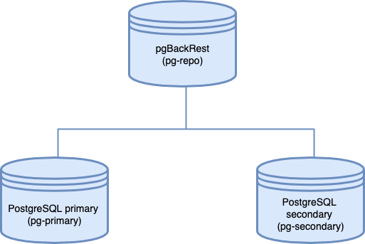

# Backup and disaster recovery in Percona Distribution for PostgreSQL

!!! summary

    - Overview
    - Architecture
    - [Deployment](dr-pgbackrest-setup.md) 
    - [Testing](dr-pgbackrest-setup.md#testing-backup-and-restore-with-pgbackrest)

## Overview

A Disaster Recovery (DR) solution ensures that a system can be quickly restored to a normal operational state if something unexpected happens. When operating a database, you would back up the data as frequently as possible and have a mechanism to restore that data when needed. Disaster Recovery is often mistaken for high availability (HA), but they are two different concepts altogether:

- High availability ensures guaranteed service levels at all times. This solution involves configuring one or more standby systems to an active database, and the ability to switch seamlessly to that standby when the primary database becomes unavailable, for example, during a power outage or a server crash. To learn more about high-availability solutions with Percona Distribution for PostgreSQL, refer to [High Availability in PostgreSQL with Patroni](high-availability.md).
- Disaster Recovery protects the database instance against accidental or malicious data loss or data corruption. Disaster recovery can be achieved by using either the options provided by PostgreSQL, or external extensions.

 

??? "**PostgreSQL disaster recovery options**"

     
    PostgreSQL offers multiple options for setting up database disaster recovery. 

    - **[pg_dump](https://www.postgresql.org/docs/15/app-pgdump.html) or the [pg_dumpall](https://www.postgresql.org/docs/15/app-pg-dumpall.html) utilities**

    This is the basic backup approach. These tools can generate the backup of one or more PostgreSQL databases (either just the structure, or both the structure and data), then restore them through the [pg_restore](https://www.postgresql.org/docs/15/app-pgrestore.html) command. 

    | Advantages   | Disadvantages   |
    | ------------ | --------------- |
    | Easy to use  | 1. Backup of only one database at a time. 2. No incremental backups. 3. No point-in-time recovery since the backup is a snapshot in time. 4. Performance degradation when the database size is large.|           
    
    - **File-based backup and restore**

    This method involves backing up the PostgreSQL data directory to a different location, and restoring it when needed. 

    | Advantages   | Disadvantages   |
    | ------------ | --------------- |
    | Consistent snapshot of the data directory or the whole data disk volume | 1. Requires stopping PostgreSQL in order to copy the files. This is not practical for most production setups.  2. No backup of individual databases or tables.|

    - **PostgreSQL [pg_basebackup](https://www.postgresql.org/docs/15/app-pgbasebackup.html)**

    This backup tool is provided by PostgreSQL. It is used to back up data when the database instance is running. `pgasebackup` makes a binary copy of the database cluster files, while making sure the system is put in and out of backup mode automatically. 

    | Advantages   | Disadvantages   |
    | ------------ | --------------- |
    | 1. Supports backups when the database is running. 2. Supports point-in-time recovery | 1. No incremental backups. 2. No backup of individual databases or tables.|    
 

To achieve a production grade PostgreSQL disaster recovery solution, you need something that can take full or incremental database backups from a running instance, and restore from those backups at any point in time. Percona Distribution for PostgreSQL is supplied with [pgBackRest](#pgbackrest): a reliable, open-source backup and recovery solution for PostgreSQL.

This document focuses on the Disaster recovery solution in Percona Distribution for PostgreSQL. The [Deploying backup and disaster recovery solution in Percona Distribution for PostgreSQL](dr-pgbackrest-setup.md) tutorial provides guidelines of how to set up and test this solution.

### pgBackRest

[pgBackRest](https://pgbackrest.org/) is an easy-to-use, open-source solution that can reliably back up even the largest of PostgreSQL databases. `pgBackRest` supports the following backup types:

* full backup - a complete copy of your entire data set.
* differential backup - includes all data that has changed since the last full backup. While this means the backup time is slightly higher, it enables a faster restore.
* incremental backup - only backs up the files that have changed since the last full or differential backup, resulting in a quick backup time. To restore to a point in time, however, you will need to restore each incremental backup in the order they were taken.

When it comes to restoring, `pgBackRest` can do a full or a delta restore. A _full_ restore needs an empty PostgreSQL target directory. A _delta_ restore is intelligent enough to recognize already-existing files in the PostgreSQL data directory, and update only the ones the backup contains. 

`pgBackRest` supports remote repository hosting and can even use cloud-based services like AWS S3, Google Cloud Services Cloud Storage, Azure Blob Storage for saving backup files. It supports parallel backup through multi-core processing and compression. By default, backup integrity is verified through checksums, and saved files can be encrypted for enhanced security.

`pgBackRest` can restore a database to a specific point in time in the past. This is the case where a database is not inaccessible but perhaps contains corrupted data. Using the point-in-time recovery, a database administrator can restore the database to the last known good state.  

Finally, `pgBackRest` also supports restoring PostgreSQL databases to a different PostgreSQL instance or a separate data directory.

## Setup overview

This section describes the architecture of the backup and disaster recovery solution. For the configuration steps, refer to the [Deploying backup and disaster recovery solution in Percona Distribution for PostgreSQL](dr-pgbackrest-setup.md).

### System architecture

As the configuration example, we will use a three server architecture where `pgBackRest` resides on a dedicated remote host. The servers communicate with each other via passwordless SSH.

!!! important

    Passwordless SSH may not be an ideal solution for your environment. In this case, consider using other methods, for example, [TLS with client certificates](https://pgbackrest.org/user-guide-rhel.html#repo-host/config).

The following diagram illustrates the architecture layout:

#### Components:

The architecture consists of three server instances:

- `pg-primary` hosts the primary PostgreSQL server. Note that "primary" here means the main database instance and does not refer to the primary node of a PostgreSQL replication cluster or a HA setup.
- `pg-repo` is the remote backup repository and hosts `pgBackRest`. It's important to host the backup repository on a physically separate instance, to be accessed when the target goes down. 
- `pg-secondary` is the _secondary_ PostgreSQL node. Don't confuse it with a hot standby. "Secondary" in this context means a PostgreSQL instance that's idle. We will restore the database backup to this instance when the primary PostgreSQL instance goes down. 

!!! note

    For simplicity, we use a single-node PostgreSQL instance as the primary database server. In a production scenario, you will use some form of high-availability solution to protect the primary instance. When you are using a high-availability setup, we recommend configuring `pgBackRest` to back up the hot standby server so the primary node is not unnecessarily loaded.

### Deployment

Refer to the [Deploying backup and disaster recovery solution in Percona Distribution for PostgreSQL](dr-pgbackrest-setup.md) tutorial.  