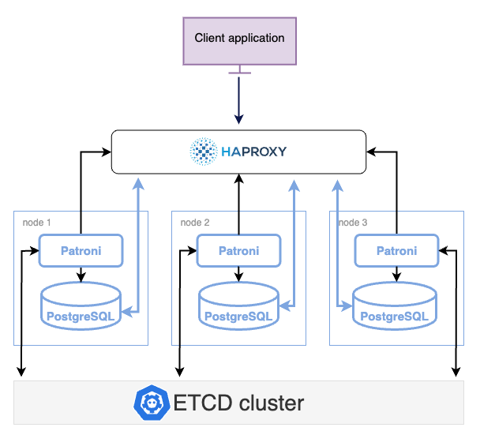

# Architecture 

As we discussed in the [overview of high availability](high-availability.md), the minimalist approach to a highly-available deployment is to have a three-node PostgreSQL cluster with the cluster management and failover mechanisms, load balancer and a backup / restore solution.

The following diagram shows this architecture with the tools we recommend to use. 

## Components

The components in this architecture are:

- PostgreSQL nodes bearing the user data. 

- Patroni - an automatic failover system. Patroni requires and uses the Distributed Configuration Store to store the cluster configuration, health and status.

- etcd - a Distributed Configuration Store.  It not only stores the state of the PostgreSQL cluster but also handles the election of a new primary. 

- HAProxy - the load balancer and the single point of entry to the cluster for client applications. 

- pgBackRest - the backup and restore solution for PostgreSQL

- Percona Monitoring and Management (PMM) - the solution to monitor the health of your cluster 

### How components work together

Each PostgreSQL instance in the cluster maintains consistency with other members through streaming replication. We use the default asynchronous streaming replication during which the primary doesn't wait for the secondaries to acknowledge the receipt of the data to consider the transaction complete. 

Each PostgreSQL instance also hosts Patroni and etcd. Patroni and etcd are responsible for creating and managing the cluster, monitoring the cluster health and handling failover in the case of the outage. 

Patroni periodically sends heartbeat requests with the cluster status to etcd. etcd writes this information to disk and sends the response back to Patroni. If the current primary fails to renew its status as leader within the specified timeout, Patroni updates the state change in etcd, which uses this information to elect the new primary and keep the cluster up and running.

The connections to the cluster do not happen directly to the database nodes but are routed via a connection proxy like HAProxy. This proxy determines the active node by querying the Patroni REST API.

