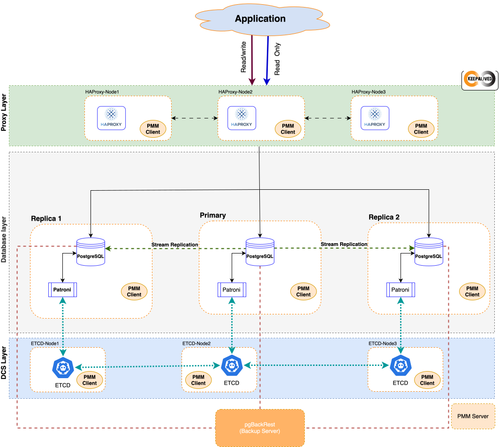
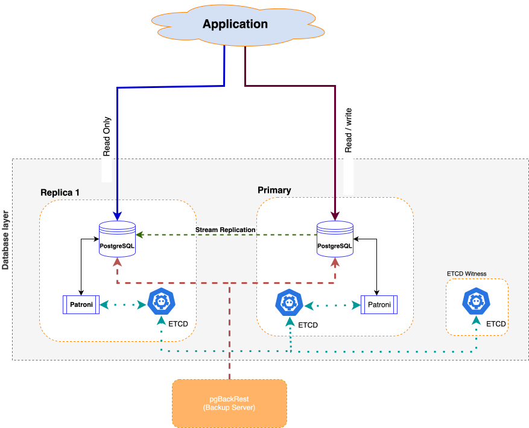

# Architecture 

In the [overview of high availability](high-availability.md), we discussed the required components to achieve high-availability. 

Our recommended minimalistic approach to a highly-available deployment is to have a three-node PostgreSQL cluster with the cluster management and failover mechanisms, load balancer and a backup / restore solution.

The following diagram shows this architecture with the tools we recommend to use. If the cost and the number of nodes is a constraint, refer to the [Bare-minimum architecture](#bare-minimum-architecture) section.

## Components

The components in this architecture are:

### Database layer

- PostgreSQL nodes bearing the user data. 

- Patroni - an automatic failover system. Patroni requires and uses the Distributed Configuration Store to store the cluster configuration, health and status.

- watchdog - a mechanism that will reset the whole system when they do not get a keepalive heartbeat within a specified timeframe. This adds an additional layer of fail safe in case usual Patroni split-brain protection mechanisms fail.

### DCS layer

- etcd - a Distributed Configuration Store. It stores the state of the PostgreSQL cluster and handles the election of a new primary. The odd number of nodes (minimum three) is required to always have the majority to agree on updates to the cluster state.  

### Load balancing layer

- HAProxy - the load balancer and the single point of entry to the cluster for client applications. Minimum two instances are required for redundancy.

- keepalived - a high-availability and failover solution for HAProxy. It provides a virtual IP (VIP) address for HAProxy and prevents its single point of failure by failing over the services to the operational instance

- (Optional) pgbouncer - a connection pooler for PostgreSQL. The aim of pgbouncer is to lower the performance impact of opening new connections to PostgreSQL.

### Services layer

- pgBackRest - the backup and restore solution for PostgreSQL. It should also be redundant to eliminate a single point of failure.

- (Optional) Percona Monitoring and Management (PMM) - the solution to monitor the health of your cluster 

## Bare-minimum architecture

There may be constraints to use the [recommended reference architecture](#architecture), like the number of available servers or the cost for additional hardware. You can still achieve high-availability with the minimum two database nodes and three `etcd` instances. The following diagram shows this architecture:

Using such architecture has the following limitations:

* This setup only protects against a one node failure, either a database or a etcd node. Losing more than one node results in the read-only database.
* The application must be able to connect to multiple database nodes and fail over to the new primary in the case of outage.
* The application must act as the load-balancer. It must be able to determine read/write and read-only requests and distribute them across the cluster. 
* The `pbBackRest` component is optional but highly-recommended for disaster recovery. To eliminate a single point of failure, it should also be redundant but we're not discussing redundancy in this solution. [Contact us](https://www.percona.com/about/contact) to discuss it if this is the requirement for you.

## Additional reading

[How components work together](ha-components.md){.md-button}

## Next steps 

[Deployment - initial setup](ha-init-setup.md){.md-button}