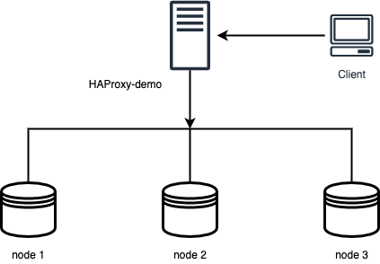

# High Availability in PostgreSQL with Patroni

!!! summary

    - Solution overview
    - Cluster deployment
    - Testing the cluster

PostgreSQL has been widely adopted as a modern, high-performance transactional database. A highly available PostgreSQL cluster can withstand failures caused by network outages, resource saturation, hardware failures, operating system crashes, or unexpected reboots.  Such cluster is often a critical component of the enterprise application landscape, where [four nines of availability](https://en.wikipedia.org/wiki/High_availability#Percentage_calculation) is a minimum requirement. 

This document provides instructions on how to set up and test a highly-available, single-primary, three-node cluster with Percona PostgreSQL and [Patroni](#patroni). 

??? admonition "High availability overview"

    There are a few methods for achieving high availability with PostgreSQL:

    - shared disk failover, 
    - file system replication, 
    - trigger-based replication, 
    - statement-based replication, 
    - logical replication, and 
    - Write-Ahead Log (WAL) shipping.

    In recent times, PostgreSQL high availability is most commonly achieved with [streaming replication](#streaming-replication).

    ## Streaming replication

    Streaming replication is part of Write-Ahead Log shipping, where changes to the WALs are immediately made available to standby replicas. With this approach, a standby instance is always up-to-date with changes from the primary node and can assume the role of primary in case of a failover.

    ### Why native streaming replication is not enough

    Although the native streaming replication in PostgreSQL supports failing over  to the primary node, it lacks some key features expected from a truly highly-available solution. These include:

    * No consensus-based promotion of a “leader” node during a failover
    * No decent capability for monitoring cluster status 
    * No automated way to bring back the failed primary node to the cluster
    * A manual or scheduled switchover is not easy to manage 

    To address these shortcomings, there are a multitude of third-party, open-source extensions for PostgreSQL. The challenge for a database administrator here is to select the right utility for the current scenario. 

    Percona Distribution for PostgreSQL solves this challenge by providing the [Patroni](https://patroni.readthedocs.io/en/latest/) extension for achieving PostgreSQL high availability.

## Patroni

[Patroni](https://patroni.readthedocs.io/en/latest/) provides a template-based approach to create highly available PostgreSQL clusters. Running atop the PostgreSQL streaming replication process, it integrates with watchdog functionality to detect failed primary nodes and take corrective actions to prevent outages. Patroni also provides a pluggable configuration store to manage distributed, multi-node cluster configuration and comes with REST APIs to monitor and manage the cluster. There is also a command-line utility called _patronictl_ that helps manage switchovers and failure scenarios.

## Architecture layout

The following diagram shows the architecture of a three-node PostgreSQL cluster with a single-leader node. 

### Components

The following are the components:

- Three PosgreSQL nodes: `node1`, `node2` and `node3`
- A dedicated HAProxy node `HAProxy-demo`. HAProxy is an open-source load balancing software through which client connections to the cluster are routed.
- ETCD - a distributed configuration storage
- Softdog - a watchdog utility which is used to detect unhealthy nodes in an acceptable time frame.

## Deployment

Use the links below to navigate to the setup instructions relevant to your operating system

- [Deploy on Debian or Ubuntu](ha-setup-apt.md)
- [Deploy on Red Hat Enterprise Linux or CentOS](ha-setup-yum.md)

## Testing

See the [Testing PostgreSQL cluster](ha-test.md) for the guidelines on how to test your PostgreSQL cluster for replication, failure, switchover.