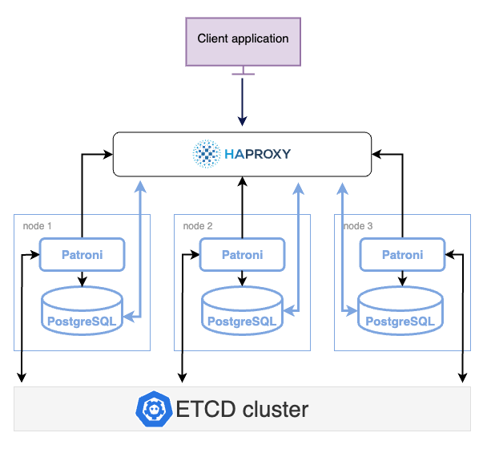

# High Availability in PostgreSQL with Patroni

!!! summary

    - Solution overview
    - Cluster deployment
    - Testing the cluster

PostgreSQL has been widely adopted as a modern, high-performance transactional database. A highly available PostgreSQL cluster can withstand failures caused by network outages, resource saturation, hardware failures, operating system crashes or unexpected reboots. Such cluster is often a critical component of the enterprise application landscape, where [four nines of availability](https://en.wikipedia.org/wiki/High_availability#Percentage_calculation) is a minimum requirement. 

There are several methods to achieve high availability in PostgreSQL. In this description we use [Patroni](#patroni) - the open-source extension to facilitate and manage the deployment of high availability in PostgreSQL.

???+ admonition "High availability methods"

    There are a few methods for achieving high availability with PostgreSQL:

    - shared disk failover, 
    - file system replication, 
    - trigger-based replication, 
    - statement-based replication, 
    - logical replication, 
    - Write-Ahead Log (WAL) shipping, and
    - [streaming replication](#streaming-replication)

    ## Streaming replication

    Streaming replication is part of Write-Ahead Log shipping, where changes to the WALs are immediately made available to standby replicas. With this approach, a standby instance is always up-to-date with changes from the primary node and can assume the role of primary in case of a failover.

    ### Why native streaming replication is not enough

    Although the native streaming replication in PostgreSQL supports failing over  to the primary node, it lacks some key features expected from a truly highly-available solution. These include:

    * No consensus-based promotion of a “leader” node during a failover
    * No decent capability for monitoring cluster status 
    * No automated way to bring back the failed primary node to the cluster
    * A manual or scheduled switchover is not easy to manage 

    To address these shortcomings, there are a multitude of third-party, open-source extensions for PostgreSQL. The challenge for a database administrator here is to select the right utility for the current scenario. 

    Percona Distribution for PostgreSQL solves this challenge by providing the [Patroni](https://patroni.readthedocs.io/en/latest/) extension for achieving PostgreSQL high availability.

## Patroni

[Patroni](https://patroni.readthedocs.io/en/latest/) provides a template-based approach to create highly available PostgreSQL clusters. Running atop the PostgreSQL streaming replication process, it integrates with watchdog functionality to detect failed primary nodes and take corrective actions to prevent outages. Patroni also relies on a pluggable configuration store to manage distributed, multi-node cluster configuration and store the information about the cluster health there. Patroni comes with REST APIs to monitor and manage the cluster and has a command-line utility called _patronictl_ that helps manage switchovers and failure scenarios.

### Key benefits of Patroni:

* Continuous monitoring and automatic failover
* Manual/scheduled switchover with a single command
* Built-in automation for bringing back a failed node to cluster again.
* REST APIs for entire cluster configuration and further tooling.
* Provides infrastructure for transparent application failover
* Distributed consensus for every action and configuration.
* Integration with Linux watchdog for avoiding split-brain syndrome.

## Architecture layout

The following diagram shows the architecture of a three-node PostgreSQL cluster with a single-leader node. 

### Components

The components in this architecture are:

- PostgreSQL nodes 
- Patroni provides a template for configuring a highly available PostgreSQL cluster.

- ETCD is a Distributed Configuration store that stores the state of the PostgreSQL cluster. 

- HAProxy is the load balancer for the cluster and is the single point of entry to client applications. 

- Softdog - a watchdog utility which is used by Patroni to check the nodes' health. Watchdog resets the whole system when it doesn't receive a keepalive heartbeat within a specified time. 

### How components work together

Each PostgreSQL instance in the cluster maintains consistency with other members through streaming replication. Each instance hosts Patroni - a cluster manager that monitors the cluster health. Patroni relies on the operational ETCD cluster to store the cluster configuration and sensitive data about the cluster health there. 

Patroni periodically sends heartbeat requests with the cluster status to ETCD. ETCD writes this information to disk and sends the response back to Patroni. If the current primary fails to renew its status as leader within the specified timeout, Patroni updates the state change in ETCD, which uses this information to elect the new primary and keep the cluster up and running.

The connections to the cluster do not happen directly to the database nodes but are routed via a connection proxy like HAProxy. This proxy determines the active node by querying the Patroni REST API.

## Deployment

Use the following links to navigate to the setup instructions relevant to your operating system:

- [Deploy on Debian or Ubuntu](ha-setup-apt.md)
- [Deploy on Red Hat Enterprise Linux or CentOS](ha-setup-yum.md)

## Testing

See the [Testing PostgreSQL cluster](ha-test.md) for the guidelines on how to test your PostgreSQL cluster for replication, failure, switchover.