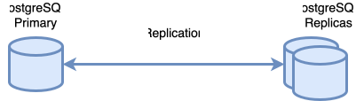
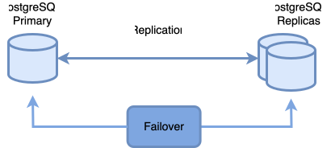
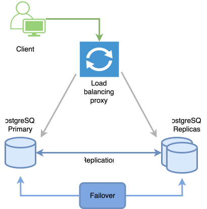
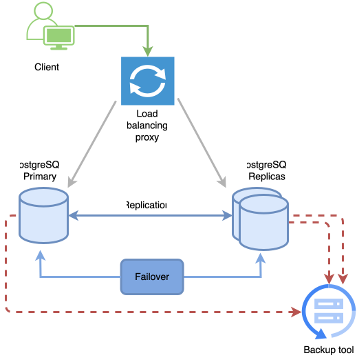

# High Availability in PostgreSQL with Patroni

Whether you are a small startup or a big enterprise, downtime of your services may cause severe consequences, such as loss of customers, impact on your reputation, and penalties for not meeting the Service Level Agreements (SLAs). That’s why ensuring a highly-available deployment is crucial.

But what does it mean, high availability? And how to achieve it? This document answers these questions. 

After reading this document, you will learn the following:

* [what is high availability](#what-is-high-availability)
* the recommended [reference architecture](ha-architecture.md) to achieve it
* how to deploy it using our step-by-step deployment guides for each component. The deployment instructions focus on the minimalistic approach to high availability that we recommend. It also gives instructions how to deploy additional components that you can add when your infrastructure grows.
* how to verify that your high availability deployment works as expected, providing replication and failover with the [testing guidelines](ha-test.md)
* additional components that you can add to address existing limitations on to your infrastructure. An example of such limitations can be the ones on application driver/connectors, or the lack of the connection pooler at the application framework.

## What is high availability

High availability is the ability of the system to operate continuously without the interruption of services. During the outage, the system must be able to transfer the services from the failed component to the healthy ones so that they can take over its responsibility. The system must have sufficient automation to perform this transfer without the need of human intervention,  minimizing disruption and avoiding the need for human intervention.

Overall, High availability is about:

1. Reducing the chance of failures
2. Elimination of single-point-of-failure (SPOF)
3. Automatic detection of failures 
4. Automatic action to reduce the impact

### How to achieve it? 

A short answer is: add redundancy to your deployment, eliminate a single point of failure (SPOF) and have the mechanism to transfer the services from a failed member to the healthy one. 

For a long answer, let's break it down into steps. 

#### Step 1. Replication

First, you should have more than one copy of your data. This means, you need to have several instances of your database where one is the primary instance that accepts reads and writes. Other instances are replicas – they must have an up-to-date copy of the data from the primary and remain in sync with it. They may also accept reads to offload your primary. 

You must deploy these instances on separate hardware (servers or nodes) and use a separate storage for storing the data. This way you eliminate a single point of failure for your database.

The minimum number of database nodes is two: one primary and one replica. 

The recommended deployment is a three-instance cluster consisting of one primary and two replica nodes. The replicas receive the data via the replication mechanism. 

PostgreSQL natively supports logical and streaming replication. To achieve high availability, use streaming replication to ensure an exact copy of data is maintained and is ready to take over, while reducing the delay between primary and replica nodes to prevent data loss.

#### Step 2. Switchover and Failover

You may want to transfer the primary role from one machine to another. This action is called a **manual switchover**. A reason for that could be the following:

* a planned maintenance on the OS level, like applying quarterly security updates or replacing some of the end-of-life components from the server
* troubleshooting some of the problems, like high network latency.

Switchover is a manual action performed when you decide to transfer the primary role to another node. The high-availability framework makes this process easier and helps minimize downtime during maintenance, thereby improving overall availability.

There could be an unexpected situation where a primary node is down or not responding. Reasons for that can be different, from hardware or network issues to software failures, power outages and the like. In such situations, the high-availability solution should automatically detect the problem, find out a suitable candidate from the remaining nodes and transfer the primary role to the best candidate (promote a new node to become a primary). Such automatic remediation is called **Failover**.

You can do a manual failover when automatic remediation fails, for example, due to:

* a complete network partitioning 
* high-availability framework not being able to find a good candidate 
* the insufficient number of nodes remaining for a new primary election.

The high-availability framework allows a human operator / administrator to take control and do a manual failover.

#### Step 3. Load balancer

Instead of a single node you now have a cluster. How to enable users to connect to the cluster and ensure they always connect to the correct node, especially when the primary node changes? 

One option is to configure a DNS resolution that resolves the IPs of all cluster nodes. A drawback here is that only the primary node accepts all requests. When your system grows, so does the load and it may lead to overloading the primary node and result in performance degradation. 

You can write your application to send read/write requests to the primary and read-only requests to the secondary nodes. This requires significant programming experience.

Another option is to use a load-balancing proxy. Instead of connecting directly to the IP address of the primary node, which can change during a failover, you use a proxy that acts as a single point of entry for the entire cluster. This proxy provides the IP address visible for user applications. It also knows which node is currently the primary and directs all incoming write requests to it. At the same time, it can distribute read requests among the replicas to evenly spread the load and improve performance.

To eliminate a single point of failure for a load balancer, deploy minimum two instances of it for redundancy. The instances share the public IP address so that it can "float" from one instance to another in the case of a failure. To control the load balancer's state and transfer the IP address to the active instance, you also need the failover solution for load balancers.

The use of a load balancer is optional, if your application implements this logic, but is highly-recommended. 

#### Step 4. Backups 

Even with replication and failover mechanisms in place, it’s crucial to have regular backups of your data. Backups provide a safety net for catastrophic failures that affect both the primary and replica nodes. While replication ensures data is synchronized across multiple nodes, it does not protect against data corruption, accidental deletions, or malicious attacks that can affect all nodes.

Having regular backups ensures that you can restore your data to a previous state, preserving data integrity and availability even in the worst-case scenarios. Store your backups in separate, secure locations and regularly test them to ensure that you can quickly and accurately restore them when needed. This additional layer of protection is essential to maintaining continuous operation and minimizing data loss. 

The backup tool is optional but highly-recommended for data corruption recovery.

As a result, you end up with the following components for a minimalistic highly-available deployment:

* A minimum two-node PostgreSQL cluster with the replication configured among nodes. The recommended minimalistic cluster is a three-node one.
* A solution to manage the cluster and perform automatic failover when the primary node is down.
* (Optional but recommended) A load-balancing proxy that provides a single point of entry to your cluster and distributes the load across cluster nodes. You need at least two instances of a load-balancing proxy and a failover tool to eliminate a single point of failure.
* (Optional but recommended) A backup and restore solution to protect data against loss and corruption.

Optionally, you can add a monitoring tool to observe the health of your deployment, receive alerts about performance issues and timely react to them.

### What tools to use?

The PostgreSQL ecosystem offers many tools for high availability, but choosing the right ones can be challenging. At Percona, we have carefully selected and tested open-source tools to ensure they work well together and help you achieve high availability. 

In our [reference architecture](ha-architecture.md) section we recommend a combination of open-source tools, focusing on a minimalistic three-node PostgreSQL cluster.

Note that the tools are recommended but not mandatory. You can use your own solutions and alternatives if they better meet your business needs. However, in this case, we cannot guarantee their compatibility and smooth operation.

### Additional reading

[Measuring high availability](ha-measure.md){.md-button}

## Next steps

[Architecture](ha-architecture.md){.md-button}

