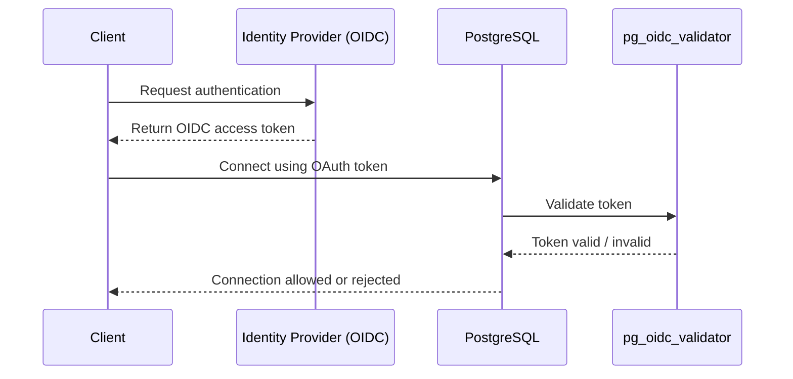

```mermaid
sequenceDiagram
    participant Client
    participant IdP as Identity Provider (OIDC)
    participant PostgreSQL
    participant Validator as pg_oidc_validator

    Client->>IdP: Request authentication
    IdP-->>Client: Return OIDC access token

    Client->>PostgreSQL: Connect using OAuth token
    PostgreSQL->>Validator: Validate token
    Validator-->>PostgreSQL: Token valid / invalid

    PostgreSQL-->>Client: Connection allowed or rejected
```
